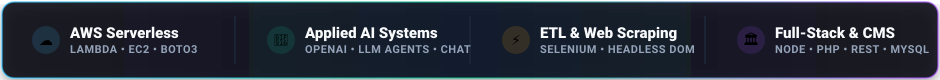
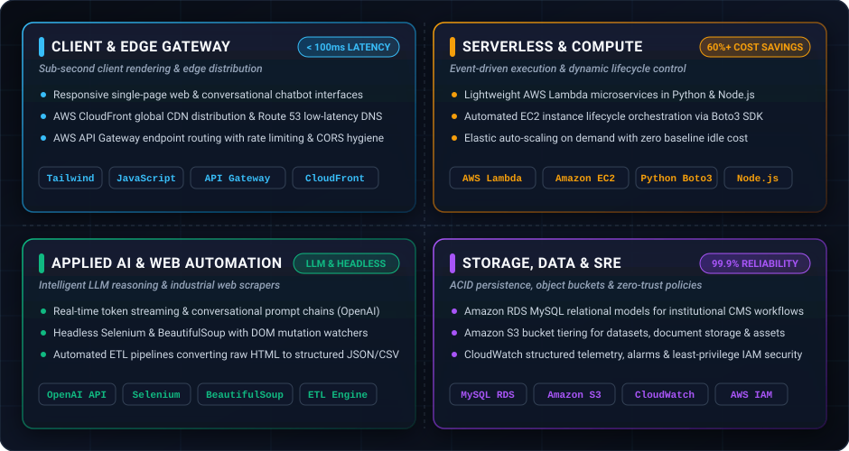
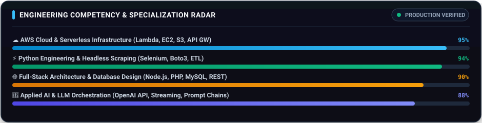
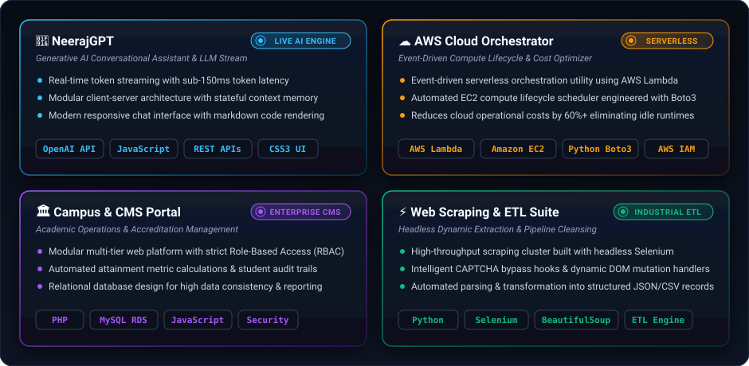

<!-- ================================================================= -->
<!-- 🌐 HERO / HEADER SECTION (Google / Staff Engineer Aesthetic)        -->
<!-- ================================================================= -->

  <!-- Dynamic Gradient Hero Banner with Brilliant WHITE Name -->
  

  <!-- Animated Real-Time Typing Stream -->
  

    

  <!-- Top Navigation Bar -->
  

    <a href="#about-me"><b>🧑‍💻 ABOUT</b></a> &nbsp;•&nbsp;
    <a href="#architecture"><b>🏛️ ARCHITECTURE</b></a> &nbsp;•&nbsp;
    <a href="#tech-stack"><b>🛠️ TECH STACK</b></a> &nbsp;•&nbsp;
    <a href="#featured-projects"><b>🚀 PROJECTS</b></a> &nbsp;•&nbsp;
    <a href="#github-analytics"><b>📊 ANALYTICS</b></a> &nbsp;•&nbsp;
    <a href="#engineering-standards"><b>⚙️ STANDARDS</b></a> &nbsp;•&nbsp;
    <a href="#contact"><b>📬 CONTACT</b></a>
  

  <!-- Modern CSS Engineering Metrics Banner -->
  

    
  

  <!-- Live Action Badges -->
  

    
    
    
    
    
  

---

<!-- ================================================================= -->
<!-- 🧑‍💻 SECTION 1: DEVELOPER TERMINAL PROFILE                           -->
<!-- ================================================================= -->
### 🧑‍💻 Engineering Profile & Terminal

  

#### 📌 Executive Summary
- ⚡ **Cloud & Serverless Engineering:** Architect of resilient cloud backends utilizing AWS services. Experienced with event-driven execution, compute orchestration, least-privilege IAM security, and cost optimization.
- 🤖 **Applied AI & Intelligent Agents:** Focused on building practical AI systems, prompt-engineered interfaces, conversational chatbots, and multi-turn LLM integrations.
- 🌐 **Enterprise Web Platforms:** Proven ability to build full-scale web platforms featuring robust Role-Based Access Control (RBAC), relational database models, and responsive interfaces.
- 🕷️ **Industrial Web Scraping & Automation:** Deep experience building resilient extraction pipelines with headless Selenium and BeautifulSoup, designed to handle dynamic single-page applications and complex workflows.

---

<!-- ================================================================= -->
<!-- 🏛️ SECTION 2: END-TO-END SYSTEM ARCHITECTURE BLUEPRINT             -->
<!-- ================================================================= -->
### 🏛️ System Design & Architecture Pattern

  

> **Core Architectural Tenets:** *Decoupled serverless microservices, sub-100ms edge latency, automated 60%+ cloud cost savings, and strict zero-trust IAM governance.*

---

<!-- ================================================================= -->
<!-- 🛠️ SECTION 3: ENTERPRISE TECH STACK MATRIX                        -->
<!-- ================================================================= -->
### 🛠️ Production Tech Stack & Tooling

#### 💻 Core Programming Languages

  

#### ☁️ Cloud, DevOps & Infrastructure

  

#### 🌐 Backend, Databases & Frameworks

  

 

<!-- Modern CSS Skills Radar & Competency Bar -->

  

 

| Technical Pillar | Production Tools & Technologies |
| :--- | :--- |
| **Languages** | `Python 3.x` `JavaScript (ES6+)` `PHP` `SQL` `HTML5 / CSS3` `Bash` `PowerShell` |
| **Cloud Infrastructure (AWS)** | `AWS Lambda (Serverless)` `Amazon EC2` `Amazon S3` `API Gateway` `CloudWatch` `IAM` `Boto3` |
| **Artificial Intelligence** | `OpenAI API` `Gemini AI Integration` `LLM Chatbots` `Prompt Engineering` `Streaming APIs` |
| **Web Scraping & Automation** | `Selenium WebDriver` `BeautifulSoup4` `Headless Chrome` `ETL Pipelines` `Task Scheduling` |
| **Backend & Frameworks** | `Node.js` `Express.js` `FastAPI` `RESTful Architecture` `MySQL` `PostgreSQL` `MongoDB` |
| **DevOps & Tooling** | `Git / GitHub` `Docker` `Linux Systems Administration` `Postman` `VS Code` `GitHub CLI` |

---

<!-- ================================================================= -->
<!-- 🚀 SECTION 4: FEATURED ENGINEERING PROJECTS                        -->
<!-- ================================================================= -->
### 🚀 Featured Engineering Projects & Case Studies

  <!-- Modern CSS Vector Projects Showcase -->
  

    

  <!-- Quick Explore Action Buttons -->
  

    
    &nbsp;
    
    &nbsp;
    
    &nbsp;
    
  

---

<!-- ================================================================= -->
<!-- 📊 SECTION 5: REAL-TIME GITHUB ANALYTICS DASHBOARD                 -->
<!-- ================================================================= -->
### 📊 Real-Time GitHub Analytics Dashboard

  <!-- Overview Stats & Top Languages Row -->
  

    
    
  

  <!-- Streak Stats Card -->
  

    
  

  <!-- Contribution Wave Graph -->
  

    
  

  <!-- Dynamic Snake Eating Contributions Animation -->
  

    <picture>
      <source media="(prefers-color-scheme: dark)" srcset="https://raw.githubusercontent.com/Neerajparashar1/Neerajparashar1/output/github-contribution-grid-snake-dark.svg">
      <source media="(prefers-color-scheme: light)" srcset="https://raw.githubusercontent.com/Neerajparashar1/Neerajparashar1/output/github-contribution-grid-snake.svg">
      
    </picture>
  

---

<!-- ================================================================= -->
<!-- ⚙️ SECTION 6: ENGINEERING STANDARDS & ARCHITECTURE DEEP DIVE       -->
<!-- ================================================================= -->
### ⚙️ Engineering Principles & Practices

  
<b>🛡️ Security, Zero-Trust & Cloud Hygiene</b> <i>(Click to expand)</i>

   
  
  - **Principle of Least Privilege (PoLP):** Strict IAM roles and resource-based policies ensuring cloud compute runs with the minimal set of required permissions.
  - **Environment Segregation:** Complete decoupling of application secrets, API keys, and configurations via `.env` and AWS Systems Manager Parameter Store.
  - **Sanitized Input & Validation:** Defensive programming at every layer to mitigate SQL injection, XSS, and unauthorized access vectors.

  
<b>📈 SRE & Reliability Mindset</b> <i>(Click to expand)</i>

   
  
  - **Graceful Failure & Backoff:** Automated retry strategies with exponential jitter for third-party APIs and network-dependent scraping routines.
  - **Idempotency:** Designing backend operations and webhook receivers to be idempotent, preventing duplicate mutations during retries.
  - **CloudWatch Observability:** Structured JSON logs and custom metric alarms to detect anomalies before they impact end users.

  
<b>🎯 Active Roadmap & 2026 Focus</b> <i>(Click to expand)</i>

   
  
  - 🧠 **Autonomous Multi-Agent AI:** Exploring agent frameworks (LangGraph, CrewAI) for end-to-end multi-step reasoning and automated tooling.
  - ☁️ **Infrastructure as Code (IaC):** Deepening automated provisioning using Terraform and AWS CloudFormation.
  - ⚡ **High-Speed Async Microservices:** Building ultra-fast asynchronous microservices with FastAPI and event queues (AWS SQS, Redis).

---

<!-- ================================================================= -->
<!-- 📬 SECTION 7: CONNECT & COLLABORATION HUB                          -->
<!-- ================================================================= -->

### 📬 Connect & Collaborate

Whether you're looking to build an AI-powered product, architect scalable cloud infrastructure, or discuss modern software engineering:

  
  &nbsp;
  
  &nbsp;
  

 

<!-- Dynamic Engineering Quote -->

  

<!-- Back to Top Navigation -->

  <a href="#top"><b>⬆ Return to Top</b></a>

<!-- Waving Footer Banner -->

 
⭐ <i>Engineered with precision by <b>Neeraj Parashar</b> • Built for scale & impact</i> ⭐

